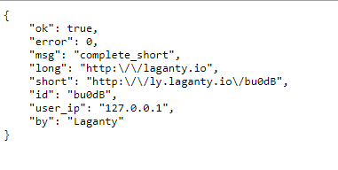
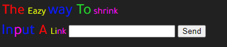

# Proton-Link
</img><br>

# What is proton Link?
it's a very simple url shortener ( API & HTMl )
* it's just to learn how to incloude mySQL and json (encode & decode) :') *

```
1. upload to your site
2. change *inc/config.php* to your mySQL details
```

```
3. in mySQL you have to create TABLE:
```

```
CREATE TABLE short(
    id INT(4) UNSIGNED AUTO_INCREMENT PRIMARY KEY,
    url VARCHAR(30) NOT NULL,
    alias VARCHAR(30) NOT NULL,
    byip VARCHAR(50)
)
```
```
#note: you can do it from mySQL console that well be better
```

```
4. have fun or! download the apk project app :)
```
[Proton-Link](http://www.mediafire.com/file/i94nkui7zz9zbws/Proton-Link.App.rar/file) apk project for *SketchWare*

# EX.

```
hard way: ( http://yourdomain.com/inc/sh.php?link=http://some link... )

eazy way: ( http://yourdomain.com and submit link :| )
```

# screen
Api:
<br></img><br>
HTML: <br>
Note: i'am like the *shit* in front-end
<br></img><br>
# terms of use
Theres no terms it's Proton-Link #FUCK#
...
# support
<br></img><br>

WALLET ID: `1JaA79FJZnLUsfPGBixb92SW84sS44YVXS`

# Developer:
TELEGRAM: http://t.me/laganty  .&.  CHANNEL: http://t.me/ty_link

GMAIL: laganty@outlook.sa  .&.

FACEBOOK: http://fb.com/laganty  .&.

INSTAGRAM: http://instagram.com/lagant.y  .&.
